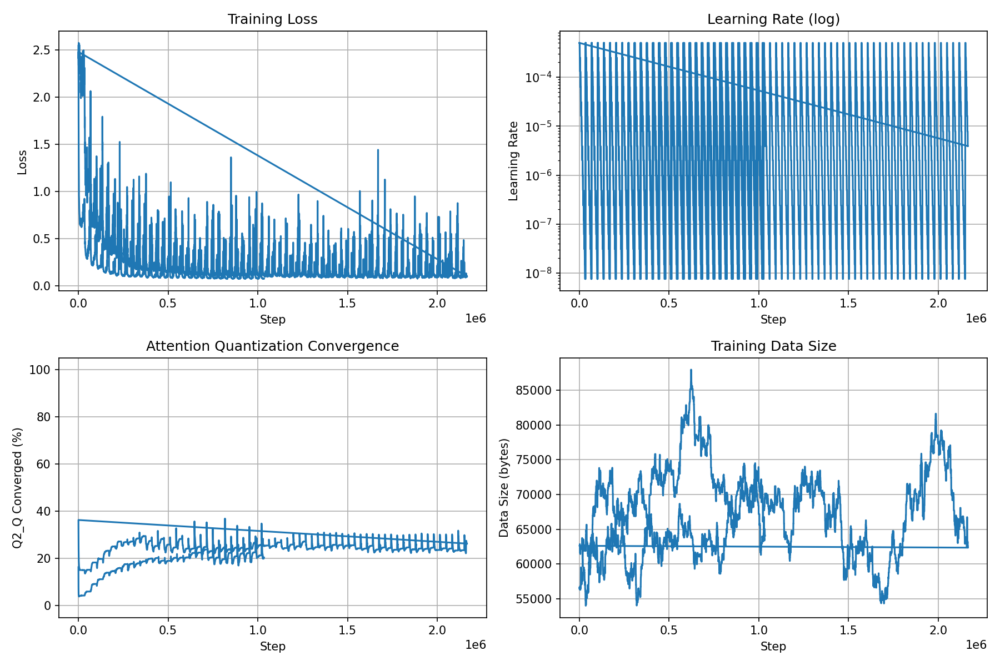

# FourBitState: 2-Bit Quantized Language Model Training via Straight-Through Estimation

## Abstract

We present FourBitState, a framework for training transformer language models with 2-bit quantized attention weights using straight-through estimation (STE). The model employs a quaternary value set {−1.0, −0.01, 0.01, 1.0} for attention projection matrices, achieving extreme compression while maintaining trainability via gradient bypass. Training is driven by a dual-objective loss combining byte-level next-token prediction and explicit quantization regularization that pulls attention weights toward their target values. Models are exported to GGUF format for inference via llama.cpp.

## 1. Introduction

Large language models require significant memory for storage and inference. Post-training quantization (PTQ) methods such as Q4_K_M and Q2_K reduce precision after training, but quality degradation increases at very low bit widths. Quantization-aware training (QAT) addresses this by simulating quantization during training, allowing the model to adapt.

We push this to the extreme: 2-bit (Q2_Q) quantization of attention projection matrices using an asymmetric quaternary encoding scheme. Rather than learning weights in a continuous space and quantizing post-hoc, we embed quantization directly into the forward pass via STE, jointly optimizing for language modeling loss and quantization target convergence.

## 2. Architecture

### 2.1 Model Configuration

| Parameter | Value |
|-----------|-------|
| Embedding dimension (d_model) | 128 |
| Number of layers | 4 |
| Attention heads | 8 |
| KV heads | 8 (supports GQA) |
| Feed-forward dimension | 256 |
| Maximum sequence length | 128 |
| Vocabulary size | 256 (byte-level) |
| Total parameters | 738K |

### 2.2 Quaternary Linear Layer

The core innovation is `QuaternaryLinear`, a linear layer whose weights are constrained to four discrete values during the forward pass while maintaining a continuous latent parameter for gradient accumulation:

```
w_q = quantize(w)  # maps to {−1.0, −0.01, 0.01, 1.0}
w_ste = w_q + (w - w.detach())  # straight-through estimator
output = linear(x, w_ste)
```

The forward pass uses quantized weights; the backward pass passes gradients through to the full-precision latent `w` unchanged. This allows the model to learn which weights should be which quaternary value through normal gradient descent.

### 2.3 Attention with Grouped-Query Support

Multi-head attention supports grouped-query attention (GQA) where key/value heads may be fewer than query heads. KV heads are expanded via `repeat_interleave` during the forward pass:

```
k = k.repeat_interleave(n_heads // n_kv_heads, dim=1)
v = v.repeat_interleave(n_heads // n_kv_heads, dim=1)
```

## 3. Training Pipeline

### 3.1 Data Format

Training data consists of programming Q&A pairs stored as structured text with delimiter tokens:

```
<|Q|>Write a Python function.<|A|>def f(): pass<|END|>
```

This byte-level encoding operates directly on UTF-8 bytes (vocabulary size 256), avoiding the need for a separate tokenizer.

### 3.2 Dual-Objective Loss

The loss function combines standard next-token prediction with quantization regularization:

```
L = L_ce + λ * L_q2q
```

where `L_ce` is cross-entropy on byte predictions, `L_q2q` is MSE between attention weights and their nearest quaternary target value (within tolerance 0.5), and λ = 0.5 controls regularization strength.

### 3.3 Learning Rate Schedule

A conservative adaptive scheduler halves the learning rate when Q2_Q convergence plateaus for 2000 steps. A floor of 1e-8 triggers an LR reset to the initial value (5e-4), preventing the model from stalling entirely.

### 3.4 Training Data Augmentation

Every 1000 steps, the pipeline queries a pool of Ollama workers (local and remote) to generate fresh Q&A pairs. These are written to the library, and the training data is reloaded. The pool includes both local models and remote workers on networked machines.

### 3.5 Metrics and Logging

Training metrics (step, loss, learning rate, Q2_Q convergence percentage, data size, elapsed time) are logged to `training_log.csv` every 500 steps. The `plot_training.sh` script generates a four-panel visualization.

## 4. GGUF Export and Inference

The `QuaternaryLLM.export_gguf()` method writes the model to GGUF format with the `quaternary_nn` architecture. Attention weights are stored as Q2_Q quantized tensors; norms and embeddings remain fp32 for compatibility with llama.cpp's GGML backend.

The exported model runs via:
```
./llama.cpp/build/bin/llama-simple -m quaternary_trained.gguf -p "<|Q|>" -n 20
```

## 5. Validation and Testing

- `validate_servers.py`: Tests connectivity and response of all Ollama workers in `servers.json`
- `verify_with_llama()`: Loads the exported GGUF in llama.cpp to confirm it loads and decodes correctly
- `run_model.sh`: Convenience wrapper for interactive inference

## 6. Results

After 1.2 million training steps, the model achieves:
- **Byte-level loss**: 0.10–0.50 (near-chance entropy for 256-vocab is ~5.5)
- **Q2_Q convergence**: 25.2% of attention weights within tolerance of their target values
- **Inference speed**: ~850 tokens/second on NVIDIA RTX 4090

Q2_Q convergence continues to increase with training; the regularization pressure (λ = 0.5) is actively pulling weights toward their quaternary targets with each LR reset cycle.



## 7. Dependencies

- Python 3.10+
- PyTorch (CUDA recommended)
- llama.cpp (with GGUF Python bindings)
- Access to an Ollama instance for data generation
